# Arkiv — consolidated pre-ETHROME test report

**Test date:** September 9, 2026  
**Network:** Tiramisu, chain ID `7738577`  
**Scope:** Arkiv Hub, both explorer interfaces, documentation, and participant dry runs of Mission 02 “Built to expire” and Mission 03 “Live Wire”  
**Status:** consolidated findings from the recorded test sessions; no fixes or subsequent live retest are implied.

## Executive assessment

The participant journey is achievable: the independent Live Wire dry run created entities through Try It Out, received creation events over WebSocket, and removed expired tickets from its UI using block updates. The surrounding tools nevertheless contain several obstacles that should be addressed before the event.

**Nine distinct defects are supported by direct browser/RPC or Hacker Pulse transaction evidence: five high, three medium, and one low priority.** The four high-priority browser/docs defects are an application crash when Data Explorer displays a permanent entity, an unusable default source on the block explorer’s Data page, a shell-quoting error in a documentation example, and the Hub’s broken Quickstart links.

The Hacker Pulse run adds a fifth high-priority defect: an attribute name accepted by the SDK is rejected on-chain after gas is spent (F09).

The independent agent’s dry run adds **five integration and onboarding findings**: incompatible older SDK examples, unclear expiry semantics, transport-dependent polling, shared sample-data collisions, and inconsistent “Create another” state. These are tracked separately from the nine directly evidenced defects. Hacker Pulse adds two further documentation gaps (D06–D07), and its MCP language issue is included as O11. Additional UX/content observations and one unresolved faucet question are included below; they are not counted as confirmed defects.

The most useful pre-event intervention is to repair the five high-priority defects and publish one version-pinned Mission 03 example that explains WebSocket transport, expiry, and filtering. The reported success of Mission 03 does not establish reconnect reliability or event-wide readiness.

## Contents

- [Scope and evidence](#scope-and-evidence)
- [Priority register](#priority-register)
- [Confirmed defects](#confirmed-defects)
- [Integration and onboarding findings](#integration-and-onboarding-findings)
- [Additional observations and open questions](#additional-observations-and-open-questions)
- [What worked](#what-worked)
- [Demo applications](#demo-applications)
- [Reproduction examples](#reproduction-examples)
- [Recommended handoff and retest](#recommended-handoff-and-retest)
- [Evidence index and limitations](#evidence-index-and-limitations)

## Scope and evidence

| Surface | Address | Coverage |
| --- | --- | --- |
| Staging Hub | https://stage.hub.arkiv.network/ | All eight main sections, resource links, project discovery, wallet modal, mobile navigation. |
| Block Explorer | https://tiramisu.explorer.arkiv.network/ | Home, block, transaction, entity history, invalid lookup, mobile menu. |
| Block Explorer Data page | https://tiramisu.explorer.arkiv.network/data | Default, experimental, and custom RPC sources; connection checks and queries. |
| Data Explorer | https://data.arkiv.network/ | Queries, pagination, generated code, live activity, empty/error states, permanent entity, mobile layout. |
| Documentation | https://docs.arkiv.network/ | Installation, network reference, entity mutation, JSON-RPC querying, search, copying, mobile navigation. |
| Hacker Pulse participant dry run | Tiramisu RPC, local SDK wallet, browser demo | Mission 02: station/presence writes, one reverted transaction, natural expiry and before/after proof. |
| Live Wire participant dry run | Hub Try It Out, Tiramisu RPC/WebSocket, local demo | Two entity writes, SDK migration, event listener, ticket board and expiry behavior; performed by the independent agent. |

Evidence labels used throughout:

- **Direct audit:** reproduced in the original browser/RPC review, with captured screenshots or request/response evidence.
- **Independent dry run:** reported by the other agent. Its screenshots, log, source files, and installed dependency versions were reviewed during consolidation where available; the workflow was not rerun.
- **Hacker Pulse run:** prior Mission 02 implementation test, with transaction receipts, 14 query snapshots, and MCP captures reviewed during consolidation.
- **Observation / open question:** an improvement or unresolved issue, not a confirmed malfunction.

The direct Hub session ran approximately 15:38–15:45 CEST, and the explorer/docs session approximately 15:54–16:07 CEST. Chrome on macOS used desktop viewports of 1720 × 1323 and 1720 × 1267, plus a 390 × 844 viewport override. This was not physical-device testing. The Hub footer displayed version `cba2f20af8483165e1cca86d078209858e417495`, build `2026-09-09T12:49:51Z`.

The independent dry run reports approximately one hour of work using Node 24. Its lockfile confirms `@arkiv-network/sdk` **0.8.0** and `viem` **2.56.3**. Hacker Pulse used SDK **0.8.0-dev.4** and Node **24.20.0**. Those versions describe the tested setups, not a claim about the latest available release.

All 29 supplied screenshots are copied into this directory. Supporting evidence is local, so the report remains usable when the entire `report-final/` directory is moved. Screenshot bytes and logs are preserved unchanged (JPEG filename extensions are corrected where the source used `.png`); any non-English test payload visible in them is original evidence, not a new example.

## Priority register

Priority reflects impact on an ETHROME participant, not a security severity score.

| ID | Priority | Finding | Evidence / original reference |
| --- | --- | --- | --- |
| F01 | High | Permanent entity crashes Data Explorer | Direct audit; explorer E01 |
| F02 | High | Block Explorer `/data` default source cannot query entities | Direct audit; explorer E02 |
| F03 | High | Copied curl example loses required string quotes | Direct audit; explorer E03 |
| F04 | High | Quickstart / Getting Started opens a 404 page | Direct audit; Hub B01; independent finding 7 adds Try It Out |
| F05 | Medium | Litepaper link opens documentation Home | Direct audit; Hub B02 |
| F06 | Medium | Tiramisu values and fees labelled ETH instead of GLM | Direct audit; explorer E04 |
| F07 | Medium | Summer Warsaw timestamps labelled CET instead of CEST | Direct audit; explorer E05 |
| F08 | Low | Generated TypeScript ignores selected page size | Direct audit; explorer E06 |
| F09 | High | SDK accepts `stationId`, but the chain rejects the write and charges gas | Hacker Pulse transaction receipt and error capture |
| D01 | High | Older SDK / ABI examples can produce a silent event stream | Independent dry run, finding 1; current SDK source reviewed |
| D02 | High | Missions need explicit block-based expiry guidance | Independent dry run, finding 2; current ABI and demo reviewed |
| D03 | Medium | WebSocket and replay choices change push into polling | Independent dry run, finding 3; local SDK/viem source reviewed |
| D04 | Medium | Shared Try It Out defaults mix participants’ sample data | Independent dry run, finding 4; screenshot corroborates collisions |
| D05 | Medium | “Create another” resets payload but retains attributes | Independent dry run, finding 4; UI transition not independently replayed |
| D06 | Medium | MCP-recommended SDK README is historical and blocked by default | Hacker Pulse MCP capture |
| D07 | Medium | SDK comment describes receipt expiry as a lower bound despite applied-event handling | Hacker Pulse source capture and matching receipt/query expiry |

## Confirmed defects

### F01 — A permanent entity crashes Data Explorer

**High · Direct audit · Data Explorer**

**Impact:** a valid query result can replace the entire application with a client-side exception page. The failure was initially encountered in Latest entities and then reproduced with a specific key on desktop.

**Reproduce:** open [Data Explorer](https://data.arkiv.network/), select Tiramisu, enter the following query, and select Execute:

```text
$key = key(0xfeb9f90dcb99e8ba1137786436b3084e01c0e2d562b779736f4165abe929b616)
```

**Actual:** the app crashes; its own JavaScript bundle logs `RangeError: Invalid time value`. A direct public RPC read confirmed the entity existed and had `expiresAt: "0xffffffffffffffff"`.

**Expected:** render the entity with a “Permanent” or “No expiration” label.

**Recommendation:** handle the permanent-expiry sentinel before converting expiry to a date, guard invalid or out-of-range dates, and contain a card-rendering error so it cannot take down the application. Date conversion is the likely mechanism; the precise failing source expression was not inspected.

The initial failure occurred at `14:02:25.439Z` in mobile Latest entities (`$expiresAt >= u64(0)`). A later reload with a newer result set succeeded. The key-specific desktop failure at `14:05:15.101Z` establishes that this is not mobile-only. No entity was created for this test.


Evidence: [RPC metadata](evidence/explorers-docs/large-expiry-rpc.json), [application stack trace](evidence/explorers-docs/data-permanent-console.json), [initial mobile crash](screenshots/explorers-docs/13-data-mobile-client-exception.jpg).

### F02 — Block Explorer /data has no working default source

**High · Direct audit · Block Explorer Data page**

**Impact:** the first entity query fails with the page’s default configuration, even though the public Tiramisu RPC can serve the same query.

**Reproduce:** open [the Data page](https://tiramisu.explorer.arkiv.network/data), select Default node → Everything → Run query.

**Actual:** `Method not found: arkiv_query`. The endpoint panel reports `NO UPSTREAM` and says `SHADOW_RPC_UPSTREAM` is unset. Its connection check returns chain ID `7738577`, but `arkiv_query`, `arkiv_getEntityCount`, and `arkiv_getBlockTiming` fail with `-32601`. The reported client is `arkiv-chain-indexer/v0.4.0-a54e449bcd15/bun-1.4.0`.

The selectable Experimental index also returns HTTP 404 because `ENTITY_QUERY_INDEX` is disabled. This is grouped under the same unavailable-source issue, not counted as a separate defect.

**Expected:** provide a working entity source by default, or guide the user to one before enabling execution.

**Verified workaround:** expand RPC endpoint, select Custom RPC URL, and use:

```text
https://rpc.tiramisu.db-chain.testnet.arkiv.network
```

The same `*` query returned 25 entities at block `226930`; the UI reported 186 ms. This is one successful observation, not a latency benchmark. Configure the backend upstream or a working public default; disable unavailable experimental/compare choices with a clear explanation.

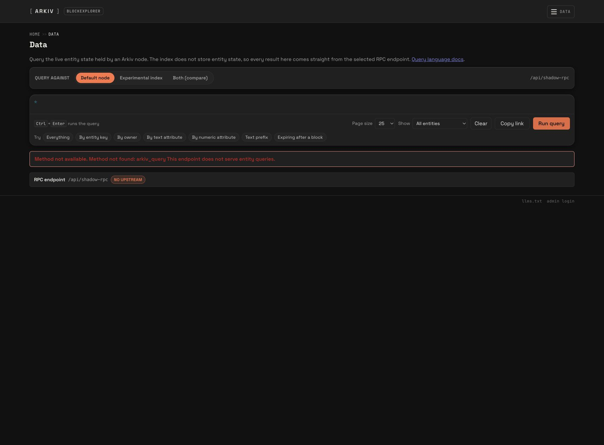

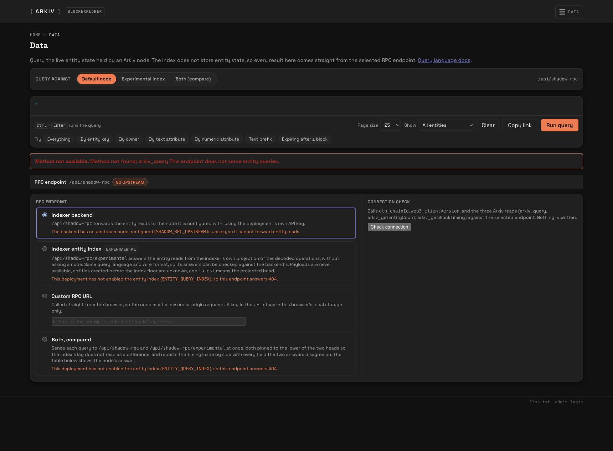

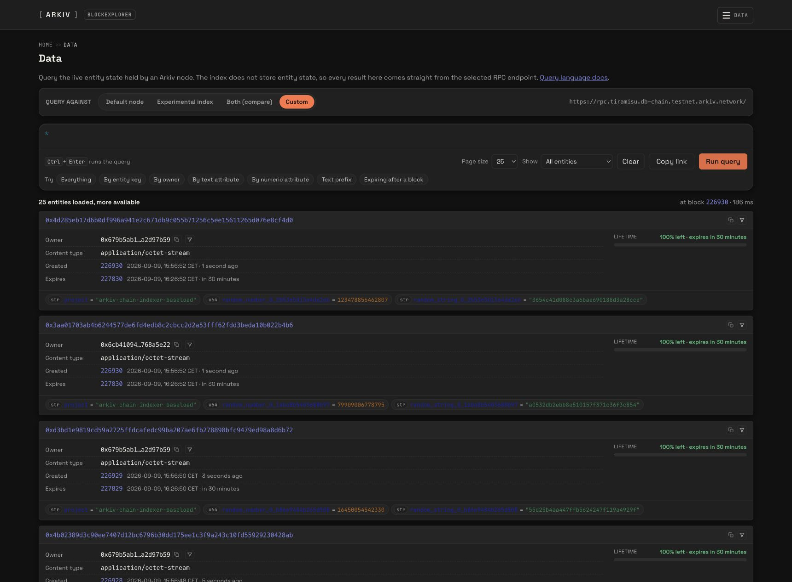

Evidence: [connection checks](evidence/explorers-docs/legacy-data-connection-check.txt), [disabled experimental index](screenshots/explorers-docs/06-data-index-disabled.jpg).

### F03 — The “By attribute” curl example loses its string quotes

**High · Direct audit · Documentation**

**Impact:** a participant copying the example sends a different, invalid query to the RPC.

**Reproduce:** copy the “By attribute” command from [JSON-RPC → Querying Data → Query Examples](https://docs.arkiv.network/json-rpc/querying-data/#query-examples) and run it in a POSIX-style shell. The JSON body is enclosed in single quotes, while its query also contains single quotes.

Intended query:

```text
type = str('nft') AND status = str('active')
```

Actual query after shell parsing:

```text
type = str(nft) AND status = str(active)
```

This was verified by capturing curl’s arguments in zsh. Sending that body to the public RPC returned `-32003`, with `str takes a single-quoted string`. Sending the correctly quoted body succeeded with an empty result at block `0x37765`. An empty result is valid: the check concerns parsing, not NFT availability.

**Expected / recommendation:** preserve query string literals through shell parsing. Use a quoted heredoc or a JSON file passed to `--data-binary @file`. Review other examples containing the same quoting pattern. A verified replacement is included in [Reproduction examples](#reproduction-examples).

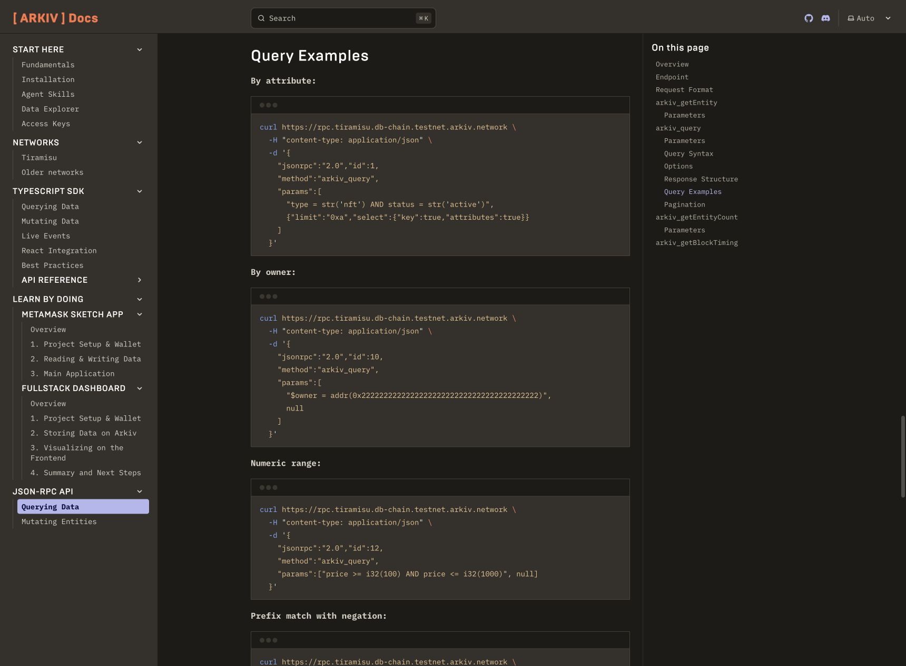

Evidence: [original command](evidence/explorers-docs/docs-query-original.sh), [parsed request](evidence/explorers-docs/docs-query-shell-result.json), [RPC error](evidence/explorers-docs/docs-original-rpc.json), [corrected response](evidence/explorers-docs/docs-corrected-rpc.json), [corrected script](evidence/explorers-docs/docs-query-corrected.sh).

### F04 — Quickstart / Getting Started opens a 404 page

**High · Direct audit, corroborated by the independent dry run · Hub → Docs**

**Reproduce:** on [Hub Home](https://stage.hub.arkiv.network/), open Resources → Getting Started, or the shared footer’s Quickstart link. Both target `https://docs.arkiv.network/quickstart`.

**Actual:** “404 | Arkiv documentation” and “Page not found” appear. The UI error was confirmed; the HTTP status was not measured. The independent agent also reports the same broken destination in Try It Out’s Done step.

**Expected:** a working guide from installation to a first write.

**Recommendation:** use [Installation](https://docs.arkiv.network/start-here/installation/), which was opened successfully and includes setup and Hello World instructions. Add a redirect from `/quickstart` to preserve old links. Home’s “03 Build with the SDK” already uses the working guide.

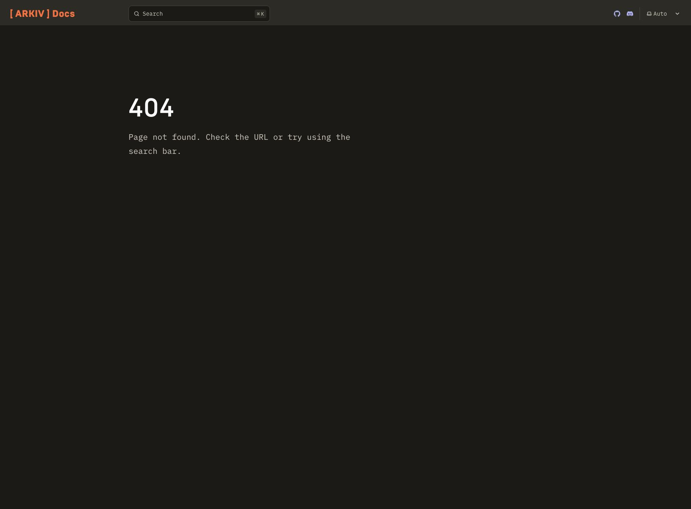

This is one shared-destination defect affecting multiple entry points, not several separate bugs.

### F05 — Read Litepaper opens the documentation homepage

**Medium · Direct audit · Hub resource links**

**Reproduce:** Home → Resources → Read Litepaper, targeting `https://arkiv.network/docs/litepaper`.

**Actual:** the browser arrives at `https://docs.arkiv.network/`, titled “Welcome to Arkiv | Arkiv documentation”. The document is not displayed.

**Expected / recommendation:** open the actual litepaper. The main website footer, inspected from its Privacy page, points to `https://arkiv.network/pdf/ARKIV_Litepaper.pdf`. This is only a candidate replacement: the PDF contents were not checked in these sessions.

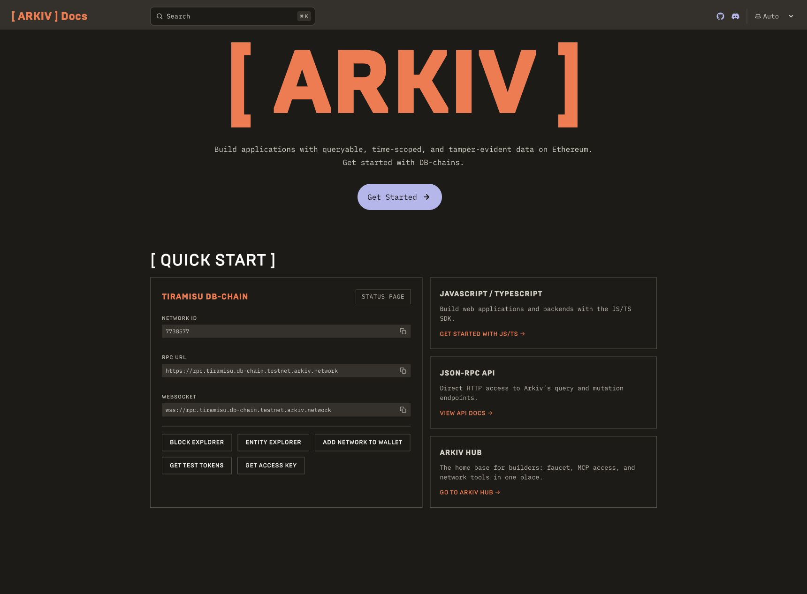

### F06 — Tiramisu fees and values are labelled ETH instead of GLM

**Medium · Direct audit · Block Explorer**

**Reproduce:** open [block 226864](https://tiramisu.explorer.arkiv.network/block?block=226864) and its [sample transaction](https://tiramisu.explorer.arkiv.network/tx/0x91d545b1b2ffbd49b12f2a9cfdf8c69e4f92aaf7432e4e11aa5926e7ba309c5d).

**Actual:** transaction value and fees use `ETH`; Home also uses `ETH` for burnt fees and wallet fee totals. The inspected [Tiramisu network reference](https://docs.arkiv.network/networks/tiramisu/) identifies GLM as the native gas token.

**Expected / recommendation:** derive the native token symbol from the selected chain and use it consistently. This is a unit-label finding; incorrect numerical fee calculations were not established.

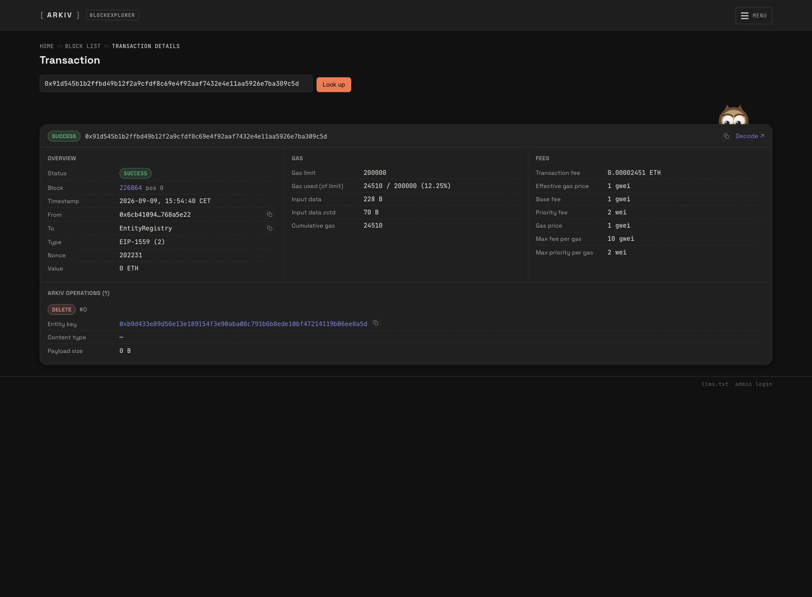

Additional evidence: [Block Explorer Home](screenshots/explorers-docs/01-block-explorer-home.jpg).

### F07 — Summer Warsaw timestamps use CET for UTC+2

**Medium · Direct audit · Block Explorer**

**Reproduce:** select Europe Warsaw and inspect the transaction in block `226864`.

**Actual:** the UI displays `2026-09-09, 15:54:40 CET`; the entity-history cell exposes `2026-09-09T13:54:40.000Z` for the corresponding event. The clock uses UTC+2, while the CET label means UTC+1.

**Expected / recommendation:** use CEST or `UTC+02:00` for this date and zone. Derive the label from the selected IANA timezone and timestamp; include a winter-date check in the fix validation.

Evidence: the transaction screenshot under F06, [entity-history timestamps](evidence/explorers-docs/entity-history.txt), and [Europe Warsaw selection](screenshots/explorers-docs/12-block-explorer-mobile-menu.jpg).

### F08 — Generated TypeScript ignores the selected page size

**Low · Direct audit · Data Explorer**

**Reproduce:** run a query, set Page size to 5, and enable the TypeScript panel.

**Actual:** the URL contains `pageSize=5` and the UI fetches five entities, but the generated snippet still uses `limit: 50`.

**Expected / recommendation:** reflect current request settings in generated code, or label the snippet as a generic example with independent defaults.

The copied snippet correctly escaped a backtick in the test string and passed `node --check`. This is a settings mismatch, not a JavaScript syntax defect. The screenshot also contains an earlier query-error banner; it is not evidence that the displayed backtick query is invalid.

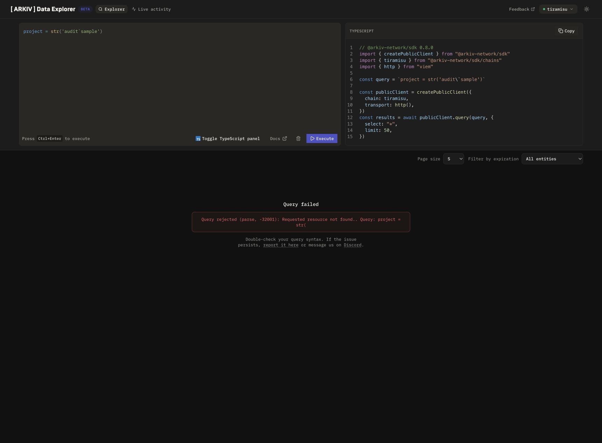

Evidence: [copied generated code](evidence/explorers-docs/generated-query.mjs). SDK runtime compatibility of this generated snippet was not tested.

### F09 — SDK accepts an attribute name that the chain rejects after gas is spent

**High · Hacker Pulse run · SDK 0.8.0-dev.4 / Tiramisu**

**Reproduce:** call `createEntity` with otherwise valid attributes including the name `stationId` and value `desk-test`. In the recorded run, SDK validation allowed the transaction to be submitted.

**Actual:** transaction `0xb469105e01c65733c194fe9e3f96fc4d7d240b58c33f9825d6ffcd3fc7c92059` reverted at block `226432`, consuming `49810` gas. The decoded message rejects uppercase `I` (`0x49`) at byte 7, while the same message lists `A–Z` among allowed characters.

**Expected:** either accept a valid name consistently or reject it locally before submission. Error text must match the node's actual grammar.

**Verified workaround:** use `station_id`; the subsequent station and presence writes succeeded. Align SDK validation, node grammar, and error wording, with a compatibility test for this case. The evidence establishes this particular name/version/network; it does not establish that every uppercase character fails, or that SDK 0.8.0 stable has the same problem.

Evidence: [failed run and decoded message](evidence/hacker-pulse/failed-camelcase-run.json), [reverted receipt](evidence/hacker-pulse/failed-camelcase-receipt.json), [successful writes](evidence/hacker-pulse/live-run.json). A screenshot is not the primary proof for this transaction-level issue.

## Integration and onboarding findings

These findings extend the browser review using the independent participant dry run. Reported behavior is distinguished from what the supplied files independently establish.

### D01 — Older SDK examples can connect successfully but receive no events

**High · SDK compatibility / onboarding · Independent dry run**

The agent first used an older event ABI and received no events despite a working connection and block reads. Moving to SDK 0.8.0 and `watchEntityEvents()` produced events. The failure scenario concerns incompatible examples or ABI definitions; it does not mean the correct 0.8.0 watcher is broken.

| Older interface reported by the agent | Tested SDK 0.8.0 interface |
| --- | --- |
| `await client.subscribeEntityEvents({...}, pollingInterval, fromBlock)` | `client.watchEntityEvents({...})` returns an unsubscribe function synchronously |
| `onEntityUpdated`, `onEntityExpiresInExtended`, `onEntityExpired` | `onEntityPatched`, `onExpiryExtended`, `onOwnershipTransferred`, `onEvent`; no expiry callback |
| `ArkivEntityCreated(uint256 indexed entityKey, address indexed owner, uint256 expirationBlock, uint256 cost)` | `EntityCreated(bytes32 indexed entityKey, address indexed owner, uint64 expiresAt, uint8 creationFlags)` |
| Older `braga` / `kaolin` chain examples | Tiramisu chain ID `7738577` in this dry run |

**Impact:** a successful RPC connection can mislead participants into debugging the network when the listener uses an incompatible event signature.

**Recommendation:** publish one canonical, version-pinned Mission 03 example using `tiramisu`, `webSocket()`, and `watchEntityEvents()`. Add a migration note covering renamed callbacks and the changed ABI. Do not suggest that all old code compiles against 0.8.0: an obsolete method call may fail explicitly, while an obsolete low-level ABI filter can remain silently unmatched.

**Evidence boundary:** the supplied log proves event reception with the working setup; the installed 0.8.0 watcher was inspected. The old failing listener and exact public URLs containing obsolete examples were not supplied, so that part remains attributed to the independent report.

Evidence: [event log](evidence/livewire/watch-log-2026-09-09.txt), [listener source](evidence/livewire/watch.mjs), [SDK source snapshot](evidence/livewire/sdk-source-evidence.txt), [dependency lockfile](evidence/livewire/package-lock.json).

### D02 — Expiry is derived from block height, not an expiry event

**High for Missions 02/03 · Documentation gap · Independent dry run and local source review**

The inspected SDK 0.8.0 event ABI contains `EntityCreated`, `EntityPatched`, `ExpiryExtended`, `OwnershipTransferred`, and `EntityDeleted`. It exposes no `EntityExpired` event or `onEntityExpired` callback.

In the independent demo, entity `0x130d8cb6da66115b211821793407f5ba0f490991c1fea4d665fe2b4374442497` had `expiresAt = 226673`. The demo logged its expiry at that block and reduced the ticket count from three to two. The agent also reports that at block `226674`, a query returned two entities and `getEntity()` for the expired key returned `NoEntityFoundError`.

**Impact:** a mission asking participants to react to expiry can send them searching for a nonexistent push callback.

**Recommendation:** explicitly state that applications track each entity’s `expiresAt` against block updates, including any subsequent expiry extension. Explain permanent entities separately. This is a documentation requirement, not a request to add a protocol event.

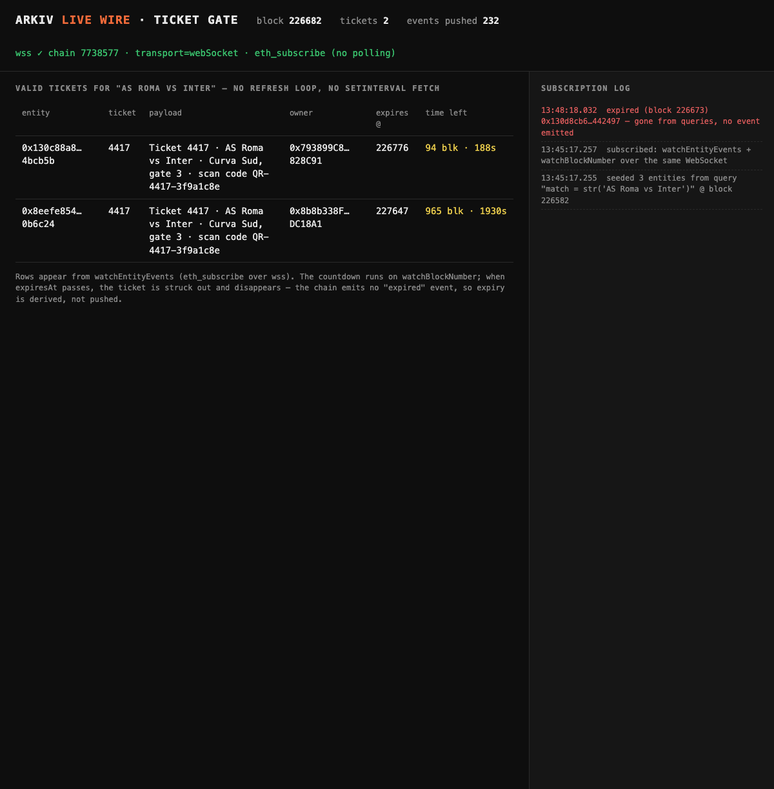

**Evidence boundary:** the screenshot and [demo source](evidence/livewire/app.js) support the UI behavior; [SDK source](evidence/livewire/sdk-source-evidence.txt) supports the absence of an expiry event in that ABI. The supplied terminal log ends at block `226576`, before expiry, so it is not used as proof of the later RPC result or a complete capture of the expiry boundary.

### D03 — HTTP transport and replay can turn a watcher into polling

**Medium · Mission 03 instructions · Independent dry run and local source review**

For the installed SDK/viem versions, `watchEntityEvents()` delegates to `watchEvent()`. HTTP uses polling, with the SDK default set to half a two-second block, or 1000 ms. WebSocket uses subscriptions when following the head. Supplying `fromBlock` through this SDK API selects viem’s polling path even when the transport is WebSocket.

The agent reports that the installation guide demonstrated `http()`, while Mission 03 requested a live WebSocket endpoint without a corresponding example.

**Impact:** an application can appear live while failing a mission’s no-polling requirement.

**Recommendation:** show an explicit WebSocket endpoint, omit `fromBlock` from the live-only starter, and document historical catch-up separately. The working dry-run endpoint was:

```text
wss://rpc.tiramisu.db-chain.testnet.arkiv.network
```

Evidence: [SDK delegation and viem transport-selection source](evidence/livewire/sdk-source-evidence.txt), [listener](evidence/livewire/watch.mjs), [event log](evidence/livewire/watch-log-2026-09-09.txt). The transport decision was checked in the installed versions; no new HTTP-versus-WebSocket experiment was run during consolidation.

### D04 — Shared Try It Out defaults mix participants’ sample data

**Medium · UX / sample design · Independent dry run, screenshot corroborated**

The default example used `match = 'AS Roma vs Inter'` and `ticket_no = 4417`. The independent agent reports that the matching query returned three entities, including another owner’s sample. The supplied screenshot visibly shows the same ticket number under different owners.

**Impact:** a participant can mistake another person’s publicly queryable sample for their own write. This is a sample-isolation issue; it is not evidence of an access-control bypass or overwritten data.

**Recommendation:** provide a unique sample identifier per participant or attempt, and teach owner-scoped queries when the intent is “show my entity”. Explain explicitly when an example intentionally queries shared public data.


### D05 — “Create another” resets the payload but keeps previous attributes

**Medium · UX / form state · Independent report only**

The agent reports that, after editing a payload and creating an entity, selecting “Create another” restored the default payload while retaining the previous attributes. A later write therefore combined retained attributes with unintended sample text.

**Expected / recommendation:** make the next-write behavior consistent: preserve the whole previous draft or reset the whole form, with a clear label. Validate payload and attributes together before submission.

**Evidence boundary:** the screenshots show the resulting different payloads, but do not record the form reset transition. This finding needs a focused UI replay before closure; no duplicate write was made during consolidation. Source: [independent report, finding 4](evidence/sources/other-agent-report.txt).

### D06 — MCP recommends an SDK whose README is marked historical

**Medium · Hacker Pulse run · MCP / SDK onboarding**

The captured `get_package({id: 'sdk-ethrome'})` response recommends SDK `0.8.0-dev.4` as compatible, but marks its published README historical because Project Setup still prescribes `^0.6.0`. The README is blocked by default, and the gateway provides pinned source references instead.

**Impact / recommendation:** the compatibility guard works, but participants must reconstruct a starter from source. Publish a verified quickstart matching the event SDK, including typed attributes, expiry, query selection, and Tiramisu. This corroborates D01's broader compatibility concern with a concrete MCP capture; it does not independently prove the older listener's silent-failure scenario.

Evidence: [MCP package response](evidence/hacker-pulse/mcp-sdk-ethrome.json). The dev.4 profile and Live Wire's stable 0.8.0 run are distinct environments and should not be conflated.

### D07 — The SDK expiry comment conflicts with applied-event handling

**Medium · Hacker Pulse run · SDK documentation**

The captured dev.4 `createEntity` return-type comment says `expiresAt` may be a lower bound computed before inclusion, while the captured implementation extracts the applied expiry from events. The bounty material treats the receipt expiry as authoritative. In the actual run, receipt and independent query both returned `226471`; no runtime expiry mismatch was observed.

**Recommendation:** reconcile the comment with implementation and distinguish requested TTL, applied expiry height, and estimated wall-clock duration. This is separate from D02's absence of an expiry notification.

Evidence: [SDK source capture](evidence/hacker-pulse/mcp-createentity.json), [bounty capture](evidence/hacker-pulse/mcp-bounty.json), [matching receipt/query values](evidence/hacker-pulse/live-run.json).

## Additional observations and open questions

| ID | Priority / status | Observation | Suggested action and evidence |
| --- | --- | --- | --- |
| O01 | Low · direct observation | Desktop has a theme switch; the mobile menu at 390 × 844 has no equivalent. | Add a mobile theme control. [Mobile menu](screenshots/hub/06-mobile-menu.jpg). |
| O02 | High before event · disclosed incomplete content | ETHROME qualification/submission requirements are marked as drafts; full guide and workshop materials are pending. Mission 03 may be disabled if WebSocket support is unavailable. | Publish deadlines, submission steps, required deliverables, and an explicit mission status. The successful independent dry run supports feasibility but does not replace an organizer decision. [ETHROME mobile](screenshots/hub/07-ethrome-mobile.jpg). |
| O03 | Low · direct observation | Ecosystem’s “Start building” goes to Home; Home’s identically labelled CTA goes to Try It Out. | Align destinations or clarify labels. The Ecosystem link works but adds a step. |
| O04 | Low · direct observation | Invalid Data Explorer syntax reports “Query rejected (parse, -32001): Requested resource not found.” | Show the parser’s specific message and location; the current resource-not-found wording is misleading. [Error state](screenshots/explorers-docs/08-data-invalid-query.jpg). |
| O05 | Low · direct observation | Pagination says “Showing 50 of 50 entities · more available”, or “10 of 10” after two small pages. | Use “50 loaded; more available” unless the actual total is known. |
| O06 | Low · direct observation | A negative block number is submitted and returns “not found in storage”. | Validate a non-negative integer before submission. A valid block lookup worked afterward. |
| O07 | Low · independent dry run | Shared-network traffic produced roughly 1–3 events per two-second block during the observation. Creation events do not contain attributes, so attribute-based filtering needs an entity read. | Teach filtering on available event metadata before fetching details, and handle entities that expire before `getEntity()`. The supplied listener filters owners in the callback; this does not reduce events delivered over the network. [Log](evidence/livewire/watch-log-2026-09-09.txt), [demo](evidence/livewire/app.js). The observed event rate is not a capacity measurement. |
| O08 | Low · independent report | MCP initialization and tool listing worked (`arkiv-ethrome 1.0.2`), but the listed tools concern documentation, network status, packages, and skills, not entity read/write operations. Browser GET returned 405 for the endpoint. | Label it as a documentation/compatibility MCP service, show a client configuration, and avoid presenting it as a normal web page. A 405 on a POST-based MCP endpoint is not itself a defect. [Source report, finding 6](evidence/sources/other-agent-report.txt). No raw transcript was supplied for this independent list; Hacker Pulse separately captured `get_package` and `get_workflow`, so this is not an exhaustive capability inventory across sessions. |
| O09 | Low · independent navigation observation | Missions are under `/ethrome`; the agent found no `/missions` route. | Consider an alias if materials or users expect it. A guessed route being absent is not a broken-link defect. |
| O10 | Low · integration guidance | The raw listener log contains “Do not know how to serialize a BigInt” while creation events continue to arrive. | Include a BigInt-safe logging example. The reviewed SDK isolates synchronous callback throws and reports them to `onError`; this log does not establish an RPC outage. [Log](evidence/livewire/watch-log-2026-09-09.txt), [corrected listener](evidence/livewire/watch.mjs). |
| O11 | Low · Hacker Pulse MCP capture | `get_workflow({name: 'minimal_app'})` returned a Spanish title and instructions without a language request, in an English onboarding context. | Provide an English default or language selection. [Workflow response](evidence/hacker-pulse/mcp-workflow-minimal.json). |
| V01 | Unverified · organizer follow-up | The independent agent saw a pre-write balance of `0.049979 GLM` against an expected faucet amount of `0.1 GLM`. Prior funding/spending was not resolved. | Inspect the claim receipt and balance history in a controlled check. Do not report an incorrect payout from this balance alone. [Source report, finding 8](evidence/sources/other-agent-report.txt). |

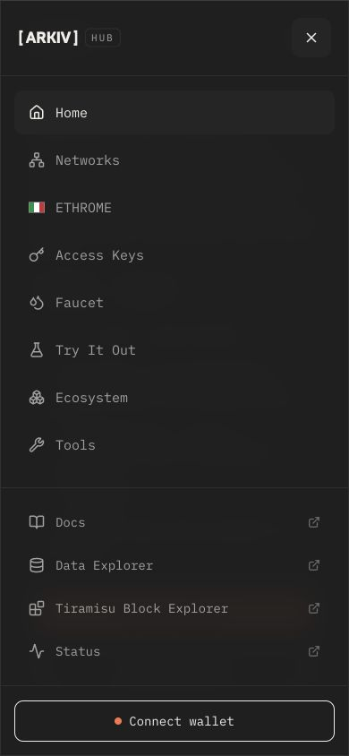

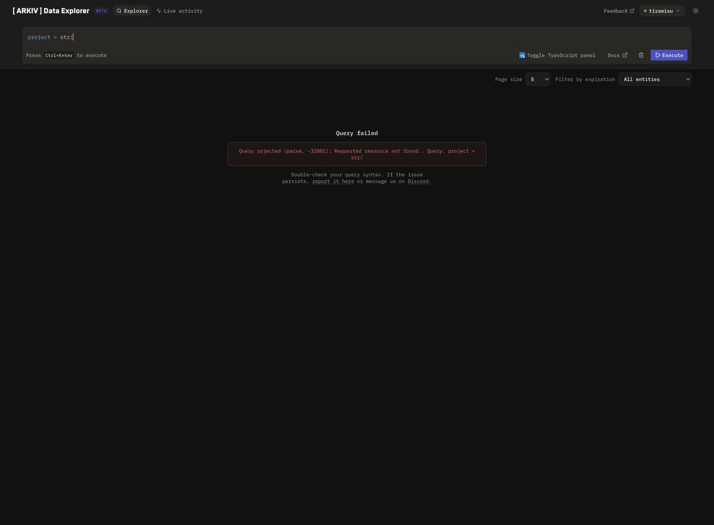

## What worked

| Area | Verified or reported successful behavior | Evidence level |
| --- | --- | --- |
| Hub navigation | Home, Networks, ETHROME, Access Keys, Faucet, Try It Out, Ecosystem, and Tools opened. Mission descriptions and ARKIV-CHUNKING limitations expanded. | Direct audit |
| Hub copying | Chain ID and RPC copied correctly; Ocean’s “Replicate This” produced a complete prompt and confirmation. | Direct audit |
| Ecosystem discovery | A nonexistent search produced a clear empty state; reset restored 116 projects; Winners selected the filter, set `winners=1`, and returned 27 projects. Counts are session snapshots. | Direct audit |
| Wallet modal | Connect wallet opened the provider list; Escape closed it and restored focus. | Direct audit; no wallet connected in that review |
| Responsive navigation | Hub menu opened, navigated, and closed after selection. Inspected Hub, explorer, and docs views showed no general layout collapse. Long Hub network addresses were clipped visually but had copy buttons. | Direct audit; viewport emulation |
| Block Explorer | Live blocks/statistics, block → transaction → deleted-entity history, CREATE/DELETE history entries, and recovery after invalid lookup worked. | Direct audit |
| Block Explorer Data page | The custom public RPC served real entities, and connection checks exposed individual method failures clearly. | Direct audit |
| Data Explorer reads | Latest entities returned 50 records; page size 5 returned five; the next page increased loaded results to ten. A nonexistent project returned “No entities found”; Ctrl+Enter executed queries; the backtick string parsed. | Direct audit |
| Data Explorer live activity | Start received CREATE and DELETE events, Stop returned to Start, and clicking a CREATE event opened a key query returning one entity. | Direct UI evidence; underlying transport/reconnect not established by this check |
| Documentation | Search for “expiration” returned 56 results and navigated to a relevant section. Installation, Tiramisu, Mutating Data, and JSON-RPC pages opened. Copy Markdown returned content with absolute links. `/api-keys` redirected to working `/access-keys`. | Direct audit |
| Mission 02 | Station and presence writes succeeded; presence was still returned at block 226470 and absent at 226471, while the station remained. Same query, no delete calls; receipt/query expiry matched. | Hacker Pulse receipts and 14 snapshots |
| Entity creation | Two entities were created through Try It Out with a connected wallet and a ten-minute / 300-block TTL. | Independent dry run |
| Mission 03 | A creation listener and ticket board operated over WebSocket; the board used block updates for expiry rather than a repeating query loop. | Independent log, screenshots, and source reviewed |
| MCP | Initialization and nine listed tools worked according to the independent report. | Reported; no raw transcript supplied |

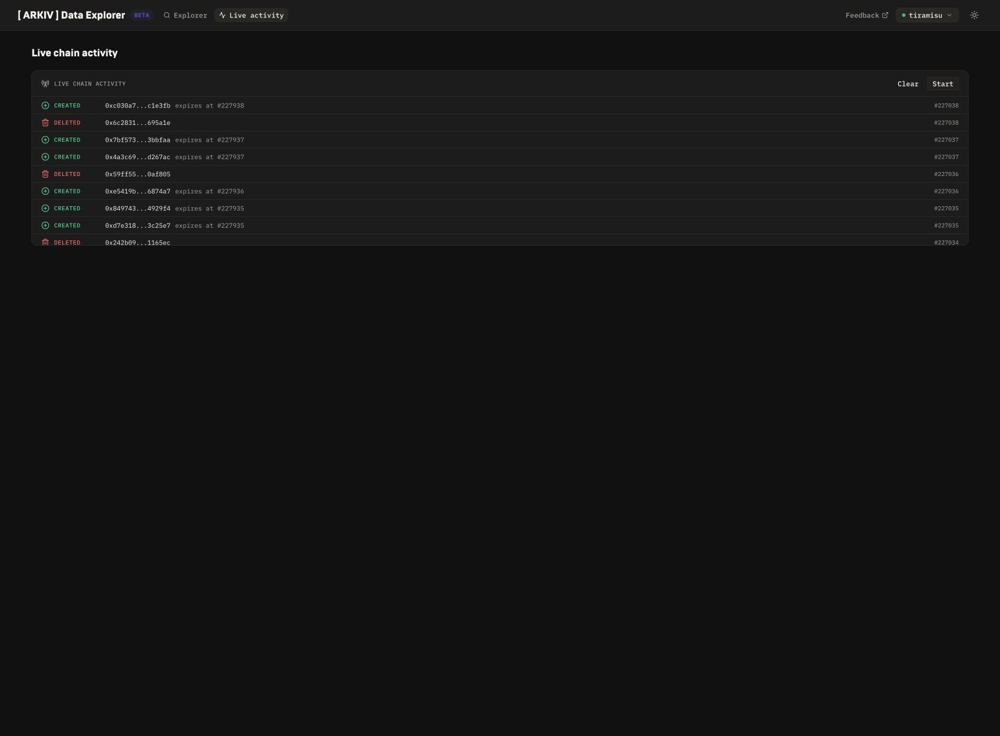

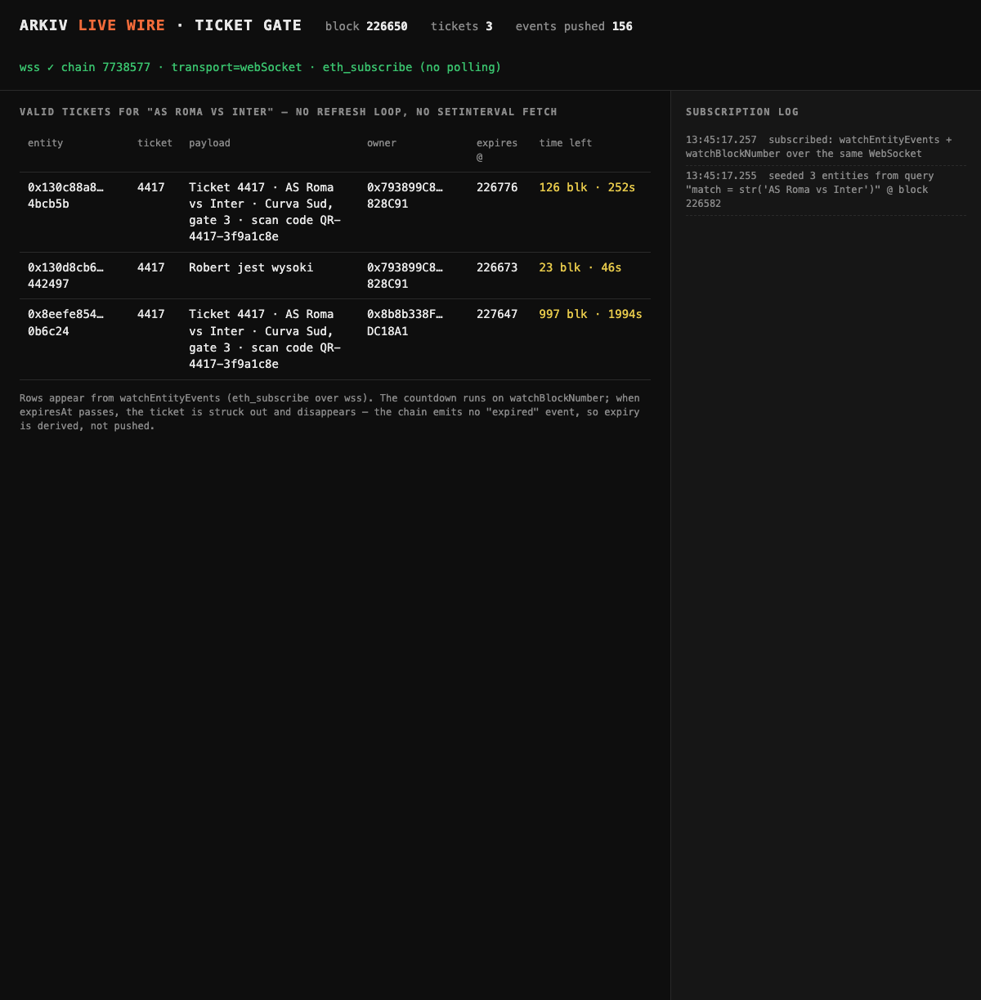

### Independent dry-run receipts

| Item | Recorded value |
| --- | --- |
| First entity | `0x130d8cb6da66115b211821793407f5ba0f490991c1fea4d665fe2b4374442497` |
| First entity lifecycle | Created at block `226373`; `expiresAt = 226673` |
| Second entity | `0x130c88a8e71a10006695db461cd10d58225640cdb869befac8875e2ab74bcb5b` |
| Second entity transaction | `0xa0758e23fae3443574da97ed1be025d07cc74c0275476b46c69c5d9fffba1500` |
| Second entity lifecycle | Created at block `226476`; `expiresAt = 226776` |
| Creation reception | `2026-09-09T13:41:44.013Z`, block `226476`, present in the supplied raw log |
| Reported query | `match = str('AS Roma vs Inter') AND ticket_no = u64(4417)` returned three entities at block `226510` |
| Reported block timing | `currentBlock: 226510`, `blockDuration: 2` |
| Expiry UI | Three tickets became two; the later screenshot shows block `226682` and a log entry for expiry at `226673` |

The independent report describes same-second delivery and infers sub-second latency. The supplied receipt establishes the callback time; it does not include a separately measured production timestamp or clock-synchronization evidence sufficient for an end-to-end latency guarantee. This report therefore treats it as a successful event-delivery observation, not a performance benchmark.

The demo addresses and deployment status are recorded below. The source files needed to understand the recorded Live Wire behavior are copied under `evidence/livewire/`.

## Demo applications

| Demo | Live URL | Repository | Verification status |
| --- | --- | --- | --- |
| Live Wire — Mission 03 | [livewire.f12lab.net](https://livewire.f12lab.net) | [cmd0s/arkiv-livewire](https://github.com/cmd0s/arkiv-livewire), private | User-confirmed during handoff: HTTPS works, WSS is connected, and events are flowing. User reports that the repository includes the app, Dockerfile, `docs/REPORT.md`, and screenshots. No new deployment test was run during consolidation. |
| Hacker Pulse — Mission 02 | [hacker-pulse.f12lab.net](https://hacker-pulse.f12lab.net) | [cmd0s/hacker-pulse](https://github.com/cmd0s/hacker-pulse), private | Live address supplied by the user. Earlier local browser/build and on-chain tests are documented; the current hosted domain was not independently retested during consolidation. |

### Hacker Pulse: natural expiry with a persistent station

Hacker Pulse represents a station with a longer-lived entity and availability with a 15-block presence entity. The same query returned the presence at block `226457` and still at `226470`; it returned no presence at `226471`, while the station remained. Both receipt and query gave `expiresAt = 226471`. The run records zero delete calls.

The screenshots below display explicitly labelled **recorded network results**, not a fresh live run. Select **View before**, then **View after** to demonstrate the evidence; select **Live** to return to current RPC reads. This differs from Live Wire's block-derived UI expiry: Hacker Pulse demonstrates disappearance from the actual query response.

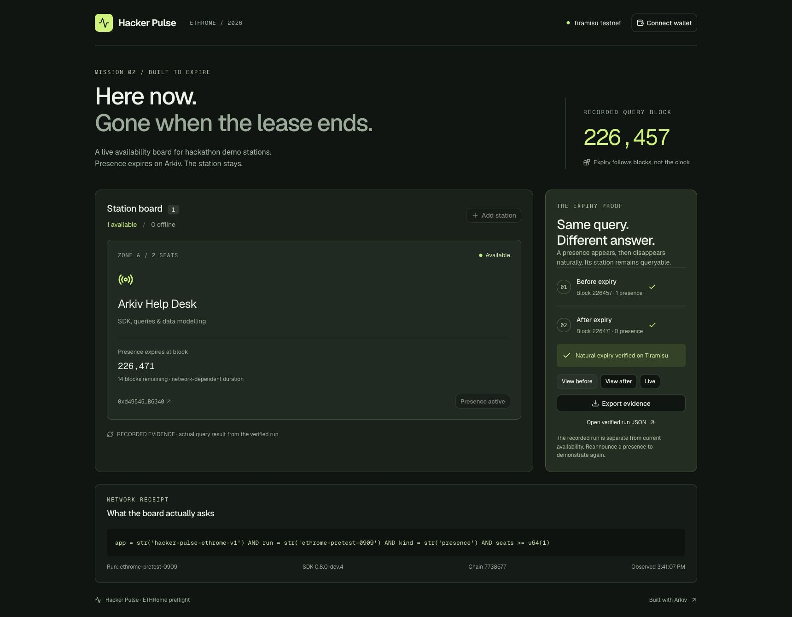

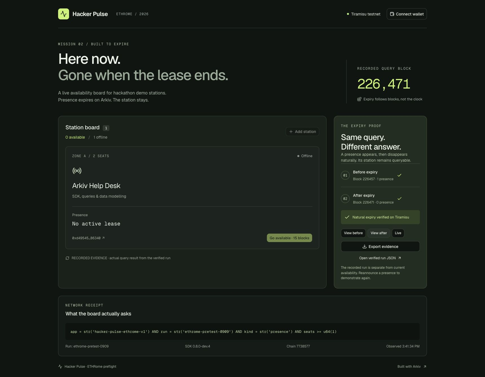

Evidence: [receipts and 14 snapshots](evidence/hacker-pulse/live-run.json). Two successful writes cost `0.000222752000445504` test GLM; including the reverted F09 transaction, total cost was `0.000272562000545124` test GLM. The before/after snapshots were 27.915 seconds apart, which is an observation of this run, not a fixed block-time guarantee.

The prior implementation record reports seven local tests, TypeScript, project-code lint, production build, and browser before/after/live controls passing. Writes used an isolated local wallet funded by the user; the app's MetaMask signing flow, faucet claims, and access-key issuance were not retested. Differing explorer hostnames in Hub/MCP were noted, but alias behavior was not tested and is not reported as an outage.

## Reproduction examples

### Correctly quoted JSON-RPC query

This read-only replacement was validated in the original audit. It preserves the single quotes required by Arkiv query syntax.

```sh
curl --silent --show-error --max-time 15 \
  https://rpc.tiramisu.db-chain.testnet.arkiv.network \
  -H 'content-type: application/json' \
  --data-binary @- <<'JSON'
{
  "jsonrpc": "2.0",
  "id": 2,
  "method": "arkiv_query",
  "params": [
    "type = str('nft') AND status = str('active')",
    {"limit": "0xa", "select": {"key": true, "attributes": true}}
  ]
}
JSON
```

File: [docs-query-corrected.sh](evidence/explorers-docs/docs-query-corrected.sh). Additional original RPC checks are in [verify_rpc.py](evidence/explorers-docs/verify_rpc.py); running them performs public reads and writes fresh result files relative to that script’s configured paths.

### Minimal live event listener for the tested versions

For a new example project, pin the versions used by the successful dry run:

```sh
npm install --save-exact @arkiv-network/sdk@0.8.0 viem@2.56.3
```

The following read-only example adapts the supplied working listener. It adds an explicit endpoint, BigInt-safe output, and cleanup. It was syntax-checked during consolidation, not rerun against the network.

```js
// Save as livewire-example.mjs and run with: node livewire-example.mjs
import { createPublicClient } from '@arkiv-network/sdk'
import { tiramisu } from '@arkiv-network/sdk/chains'
import { webSocket } from 'viem'

const client = createPublicClient({
  chain: tiramisu,
  transport: webSocket('wss://rpc.tiramisu.db-chain.testnet.arkiv.network'),
})

const stringify = (value) => JSON.stringify(value, (_, item) =>
  typeof item === 'bigint' ? item.toString() : item,
)

// Follow new events. Do not add fromBlock to this live-only example.
const stopEvents = client.watchEntityEvents({
  onEntityCreated: (event) => console.log('created', stringify(event)),
  onEntityDeleted: (event) => console.log('deleted', stringify(event)),
  onError: (error) => console.error('event watcher:', error),
})

const stopBlocks = client.watchBlockNumber({
  onBlockNumber: (blockNumber) => {
    console.log('block', blockNumber.toString())
    // A ticket board compares stored expiresAt values with this height.
    // Handle permanent entities and expiry extensions explicitly.
    // There is no EntityExpired callback in the tested SDK event ABI.
  },
  onError: (error) => console.error('block watcher:', error),
})

process.once('SIGINT', () => {
  stopEvents()
  stopBlocks()
  process.exit(0)
})
```

Download: [livewire-example.mjs](evidence/livewire/livewire-example.mjs). This is a listener skeleton, not a complete ticket-board implementation. The supplied [demo source](evidence/livewire/app.js) includes initial querying, entity reads after creation events, and local expiry handling. Its behavior is useful evidence but has not received a production-readiness review.

## Recommended handoff and retest

These are proposed follow-up checks, not work already completed.

| Order | Suggested owner | Action | Acceptance check |
| --- | --- | --- | --- |
| 1 | Data Explorer frontend | Fix F01 expiry rendering. | The recorded permanent key and ordinary expiring entities render on desktop/mobile; no app-level exception. |
| 2 | Explorer/backend operations | Fix F02 source configuration. | A fresh visit can run `*` successfully without custom configuration; disabled sources cannot be executed. |
| 3 | Docs and Hub maintainers | Fix F03/F04 and verify the F05 document destination. | Copy the example into a shell and receive valid JSON-RPC results; every Quickstart entry and the old path reach a guide; Litepaper opens the document. |
| 4 | SDK / mission authors | Fix F09 and address D01–D03, D06–D07, and O02. | Attribute validation rejects invalid names before gas is spent; a participant starting from the published, pinned example receives a creation event and can explain expiry and transport behavior; event rules are final. |
| 5 | Hub frontend | Reproduce D05 and address D04. | Two users can distinguish their samples; “Create another” treats payload and attributes consistently. |
| 6 | Explorer frontend | Fix F06–F08 and query/lookup wording. | GLM labels, correct summer/winter timezone labels, and generated page-size settings match the UI. |
| 7 | Organizers | Resolve V01 and remaining content polish. | Faucet amount is verified from receipts; MCP purpose, mission route, filters, and examples are clear. |

For a short team demonstration: show F01 with its RPC metadata; compare F02 default versus custom RPC; show F03’s parsed body and corrected command; finish with the working Live Wire screenshots and the mission documentation gaps.

## Evidence index and limitations

### Screenshot inventory

Primary screenshots are embedded next to the findings. Every supplied image is also listed here; several are supporting coverage screenshots rather than defect evidence.

| Group | Files |
| --- | --- |
| Hub desktop and links | [01 Tools](screenshots/hub/01-tools-desktop.jpg), [02 Quickstart 404](screenshots/hub/02-quickstart-404.jpg), [03 Litepaper redirect](screenshots/hub/03-litepaper-redirect.jpg) |
| Hub mobile | [04 Networks](screenshots/hub/04-networks-mobile.jpg), [05 Home](screenshots/hub/05-home-mobile.jpg), [06 menu](screenshots/hub/06-mobile-menu.jpg), [07 ETHROME](screenshots/hub/07-ethrome-mobile.jpg) |
| Block Explorer | [01 Home](screenshots/explorers-docs/01-block-explorer-home.jpg), [02 transaction](screenshots/explorers-docs/02-transaction-units-timezone.jpg), [12 mobile menu](screenshots/explorers-docs/12-block-explorer-mobile-menu.jpg) |
| Block Explorer Data page | [03 default error](screenshots/explorers-docs/03-data-default-method-not-found.jpg), [04 unconfigured endpoint](screenshots/explorers-docs/04-data-endpoint-unconfigured.jpg), [06 disabled index](screenshots/explorers-docs/06-data-index-disabled.jpg), [07 custom RPC success](screenshots/explorers-docs/07-legacy-data-custom-rpc-working.jpg), [11 mobile](screenshots/explorers-docs/11-legacy-data-mobile.jpg) |
| Data Explorer | [05 results](screenshots/explorers-docs/05-data-explorer-results.jpg), [08 invalid query](screenshots/explorers-docs/08-data-invalid-query.jpg), [09 generated TypeScript](screenshots/explorers-docs/09-typescript-page-size.jpg), [10 live activity](screenshots/explorers-docs/10-data-live-activity.jpg), [13 mobile crash](screenshots/explorers-docs/13-data-mobile-client-exception.jpg), [15 desktop crash](screenshots/explorers-docs/15-data-permanent-entity-crash-desktop.jpg) |
| Docs | [14 mobile Home](screenshots/explorers-docs/14-docs-mobile-home.jpg), [16 mobile menu](screenshots/explorers-docs/16-docs-mobile-menu.jpg), [17 curl example](screenshots/explorers-docs/17-docs-curl-quoting.jpg) |
| Hacker Pulse demo | [Before expiry](screenshots/hacker-pulse/before.jpg), [after expiry](screenshots/hacker-pulse/after.jpg) |
| Independent Live Wire demo | [01 initial board](screenshots/livewire/livewire-1.png), [02 countdown](screenshots/livewire/livewire-2-countdown.png), [03 after expiry](screenshots/livewire/livewire-3-expired.png) |

### Source provenance

The following source reports are archived as plain text to keep this directory’s narrative in one Markdown file. Their original relative links belong to their original directories; use this report’s local evidence links instead.

| Source | Original location | Local snapshot |
| --- | --- | --- |
| Hub review | `ETHROME-WORKSPACE/reports/arkiv-hub-2026-09-09/raport.md` | [hub-report.txt](evidence/sources/hub-report.txt) |
| Explorer/docs review | `ETHROME-WORKSPACE/reports/arkiv-explorers-docs-2026-09-09/report.md` | [explorers-docs-report.txt](evidence/sources/explorers-docs-report.txt) |
| Hacker Pulse friction report | `ETHROME-WORKSPACE/hacker-pulse/arkiv/friction.md` | [hacker-pulse-friction.txt](evidence/sources/hacker-pulse-friction.txt) |
| Independent agent dry run | `ETHROME-WORKSPACE-Antropic/docs/ARKIV-ETHROME-TEST-REPORT.md` | [other-agent-report.txt](evidence/sources/other-agent-report.txt) |

Duplicate Quickstart findings are merged in F04. The independent finding about Try It Out is split into D04 (shared defaults) and D05 (form reset) because they have different causes and fixes. SDK event compatibility, expiry semantics, and transport selection are retained separately. The independent latency claim is qualified, and the faucet discrepancy remains unresolved rather than being promoted to a defect.

### Limitations and exclusions

The direct browser audits were exploratory and read-only: they did not connect a wallet, sign, claim tokens, create access keys, or write entities. **The independent Live Wire dry run connected a wallet and created two testnet entities. The separate Hacker Pulse run used a funded local wallet for two successful writes and one reverted transaction.** This distinction matters when interpreting combined coverage. Consolidation itself only read existing artifacts and local dependency source, and incorporated user-supplied deployment status, then created this report bundle; it did not run new live tests or submit external feedback.

No full security, accessibility, performance, reconnect/replay, or regression audit was performed. Hacker Pulse provides a separate functional Mission 02 run; this does not imply official prize qualification under the still-draft event rules. Mission 01 and the complete set of external repositories/demo apps were not validated. The whole write tutorial and generated Data Explorer snippet were not runtime-tested in the direct audit.

The first Hub-session Data Explorer attempt was interrupted by browser-control failure; the subsequent explorer audit supplied the successful reads and confirmed defects reported here. Sandbox DNS restrictions, a Python HTTP-client 403, browser-control timeouts, and Chrome extension console messages were not counted as Arkiv defects. F01 is supported by application-bundle stack traces. An initially empty clipboard read succeeded on retry and is not classified as a copy defect.

Mobile viewport overrides were reset after the direct tests; legacy Data source selection was returned to Default node and live activity was stopped. Public result sets, counts, deployment versions, and entity availability can change. Findings describe the September 9 sessions, and a later fix requires a fresh retest.

The bundle includes [SHA-256 checksums](evidence/SHA256SUMS.txt) for supporting artifacts and a [local validation record](evidence/validation.txt). Keep the Markdown file, `screenshots/`, and `evidence/` together when sharing.
